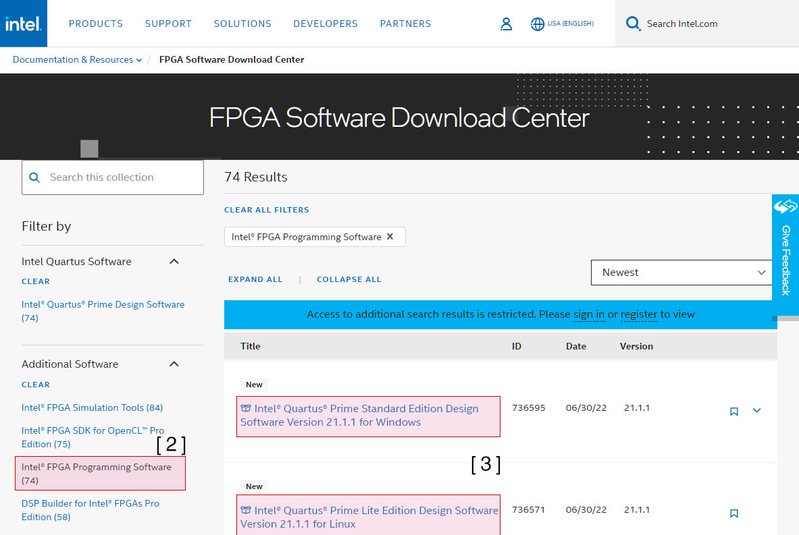
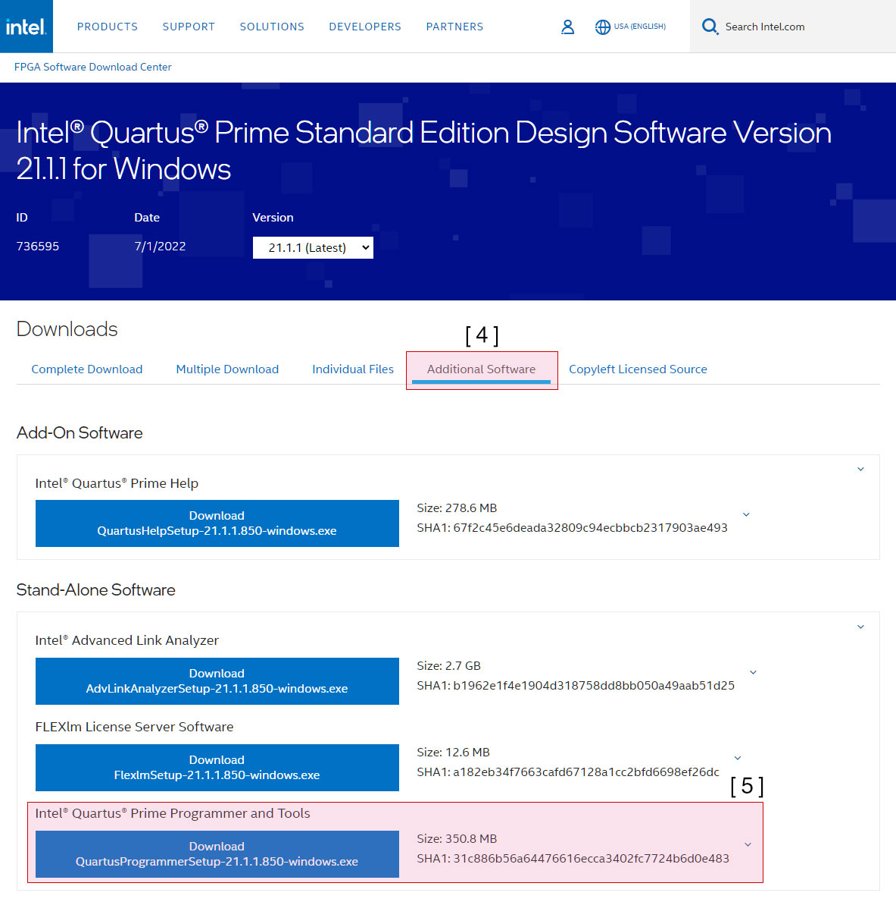
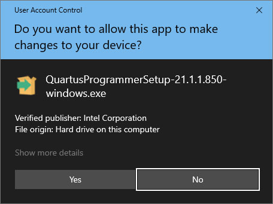
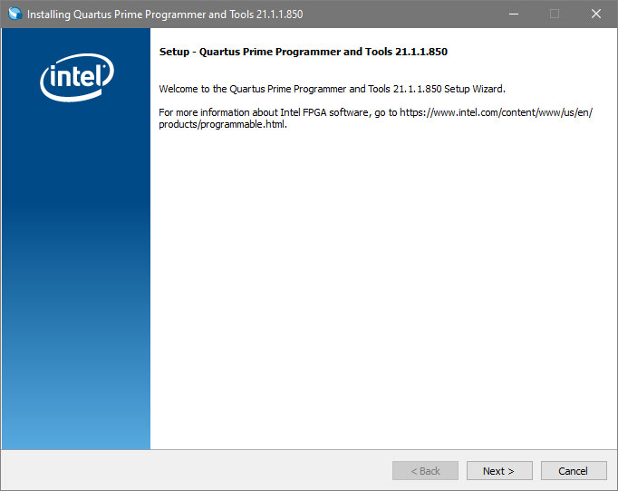
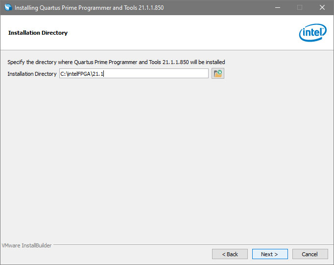
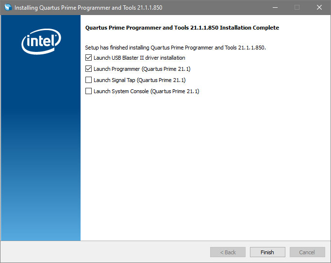
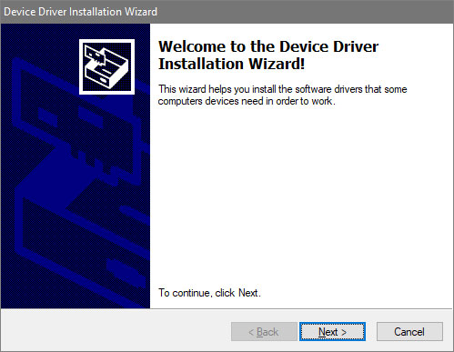
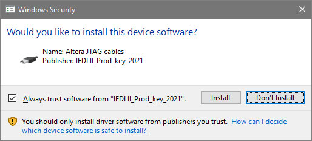
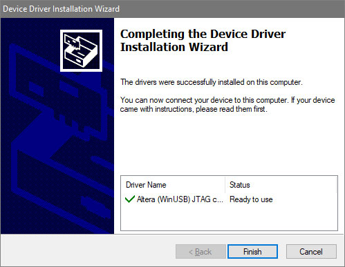
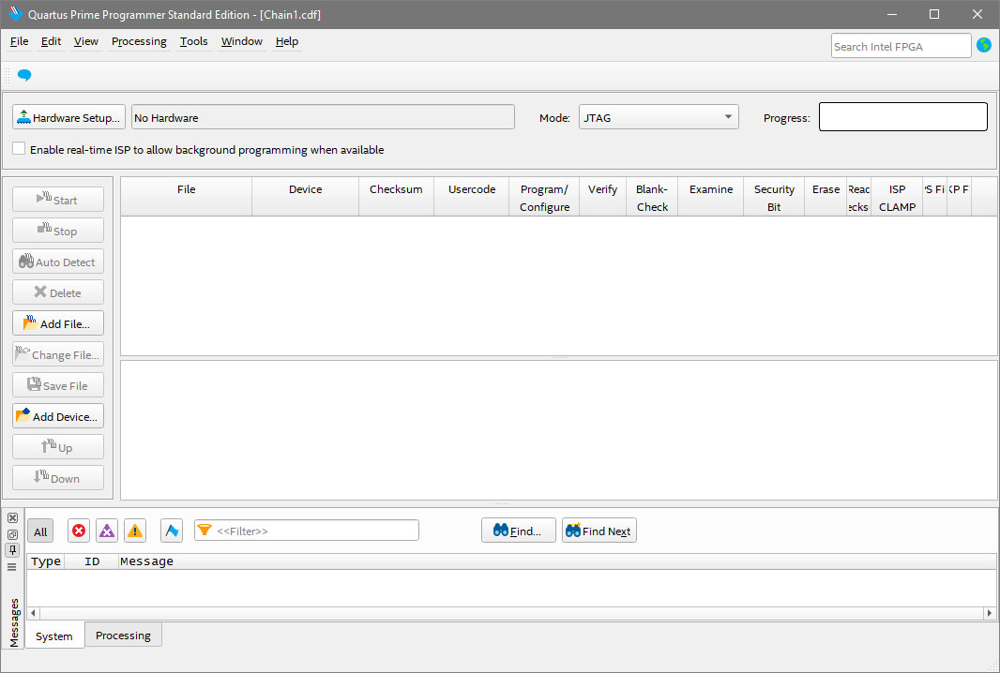

# Download and install Quartus Programmer

## Overview

If you only want to configure the FPGA code but not edit the design,
then can follow the guide to download and install Quartus Programmer.

## Download

1. Go to Intel [FPGA Software Download Center].

2. Select the `Intel® FPGA Programming Software` on the sidebar.

3. Download the latest version available for your OS (Windows or Linux).

4. Click on `Additional Software`

5. And finally under `Intel® Quartus® Prime Programmer and Tools ` click `Download QuartusProgrammerSetup-21.1.1.850-windows.exe`.

## Install

1. Open the downloaded file and confirm the 

2. Execute the Setup file to start installation.

> **Note:** Quartus needs to have administrator rights in order to install, click **"Yes"** to continue.

3. Start the installation.

4. Choose installation path.

5. Completed the installation, and leave `Launch USB Blaster II driver Installation` and `Launch Programmer` selected.

6. Start the driver installation.

7. Confirm the driver installation.

8. Complete the installation.

   
9. Quartus Prime Programmer is now installed and ready to use.

## How to use the Quartus Programmer Tool

- [How to use the Quartus Programmer Tool](programmer-tool.md)

[FPGA Software Download Center]: https://www.intel.com/content/www/us/en/collections/products/fpga/software/downloads.html
